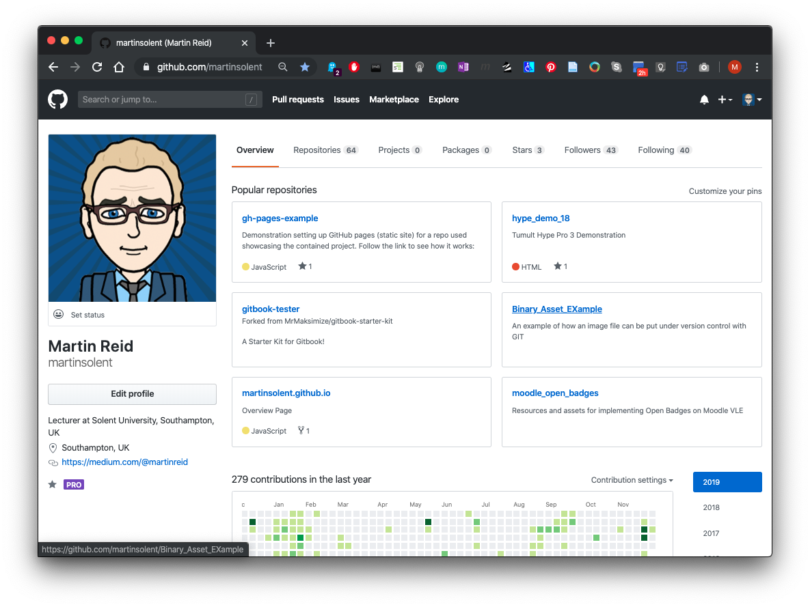
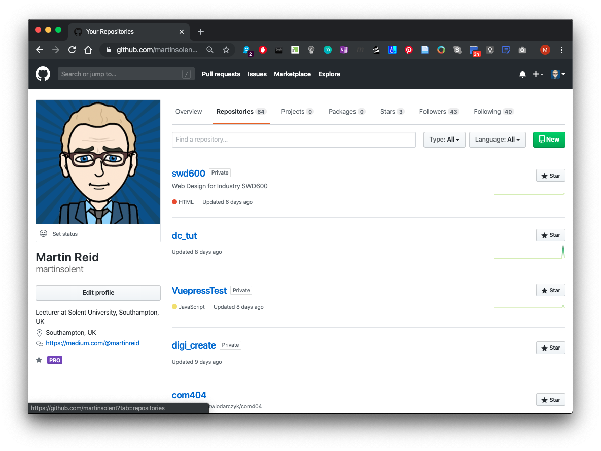
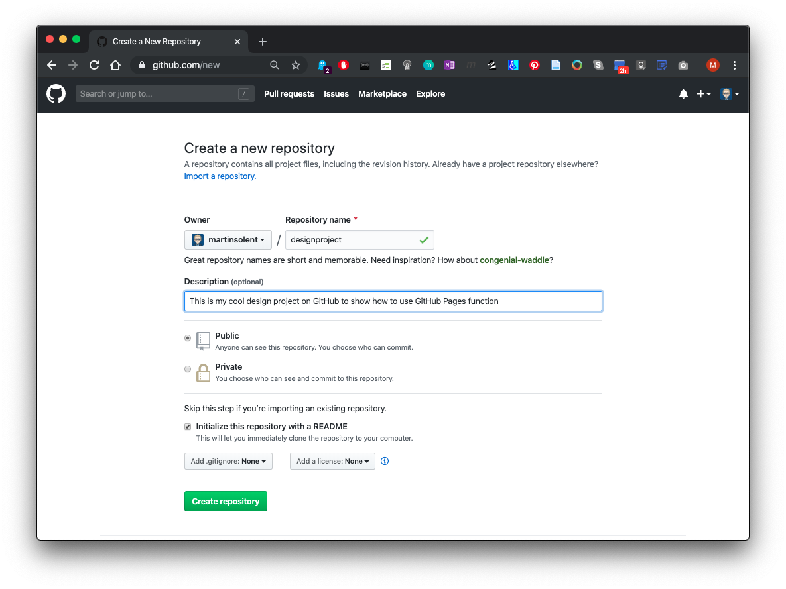
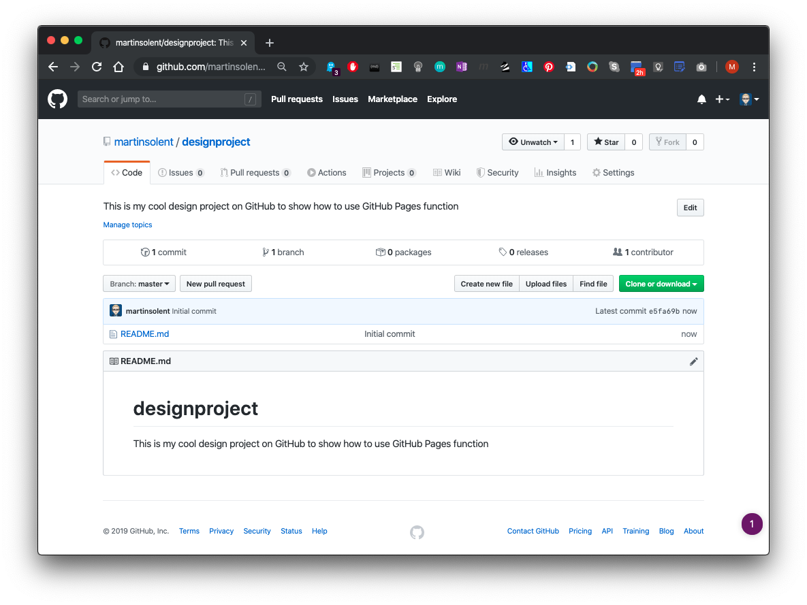
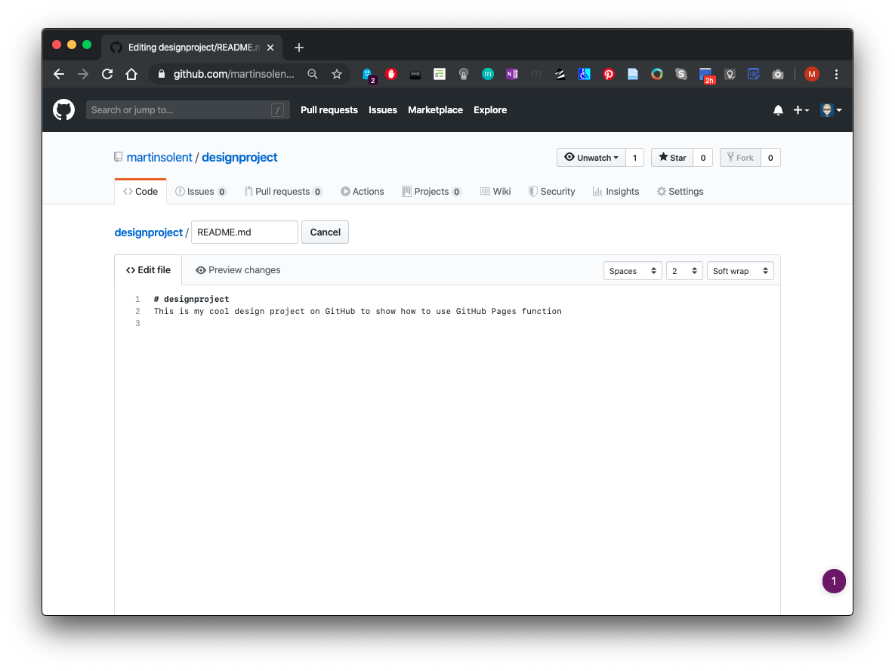
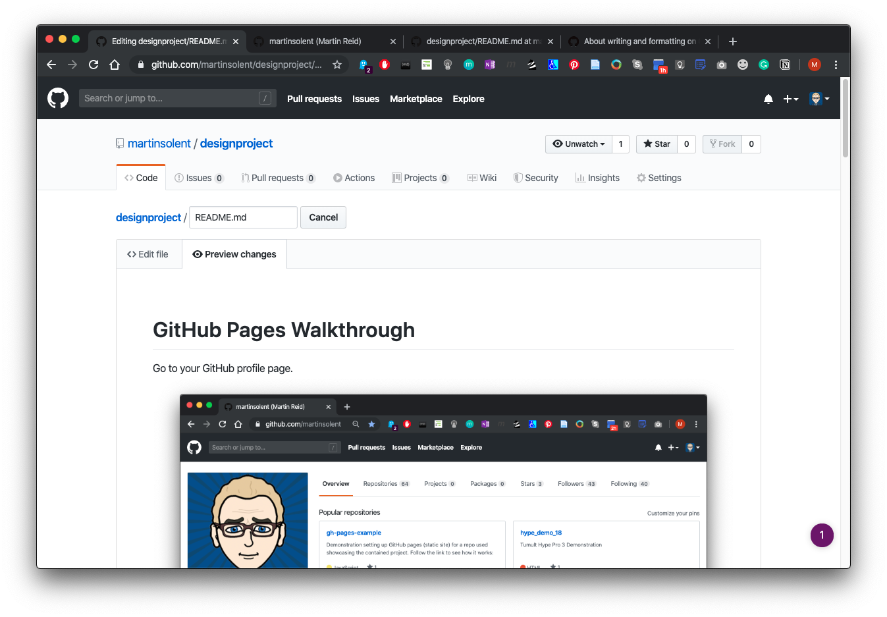
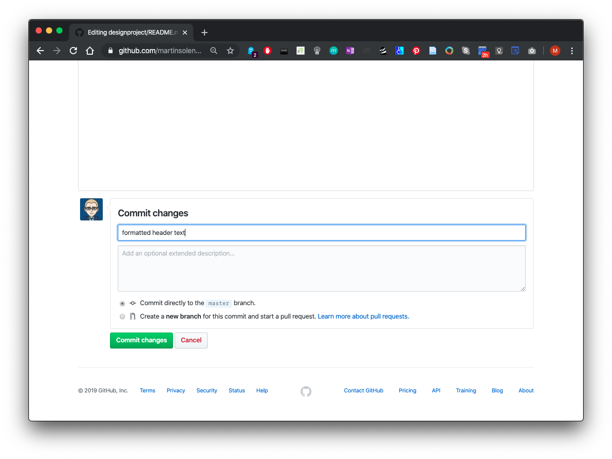
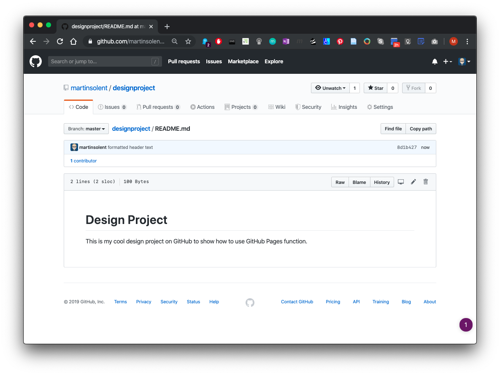

# GitHub Pages Walkthrough

Go to your GitHub profile page.

Click on Repositories then click the New button to create a new Repository (repo).

Give your new repo a name and a description, and check Initialize this repository with a README and check add  & click Create Repository

Your new repo will look like this. Now click the pencil icon to edit

You must write & edit using [Markdown](https://guides.github.com/pdfs/markdown-cheatsheet-online.pdf)

You can check to Preview mode by clicking on the Preview changes tab

You will need to Commit any changes, give it a meaningful name

